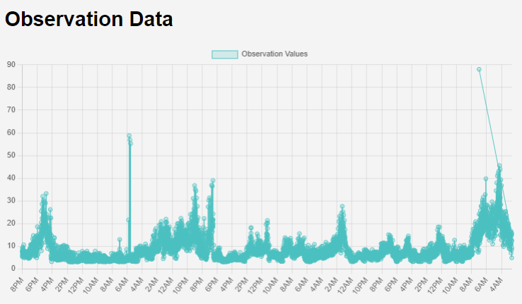

# BASE air quality monitoring system project.
This is the 2023-2024 BASE senior Data Design App development project.

The example project is here https://breathe-easy-app-test.onrender.com

Data was sourced from the NYCOpenData:
https://data.cityofnewyork.us/Environment/Air-Quality/c3uy-2p5r/about_data

and NYC Environment and Health Data Portal:
https://a816-dohbesp.nyc.gov/IndicatorPublic/key-topics/airquality/

Based on an idea developed with Jason Striegel, the original code base for that idea is here: https://github.com/jmstriegel/Plantower_PMS7003

Technology used:
* HTML
* CSS
* JavaScript
* Chart.js
* Node.js
* PostgreSQL

To start the project, you'll need a web-service and PostgreSQL database server and run node server.js.

Instructions on how to set up the database with pgadmin are here: https://docs.google.com/document/d/16JqAahguG0v4fBVIKik9hpVZGbymY985X3TAe-Z2CKo/edit